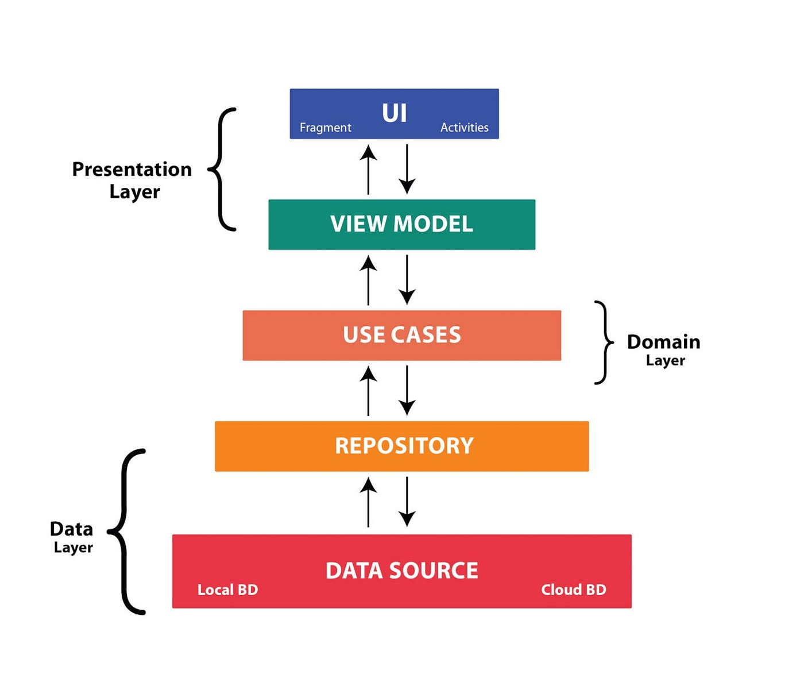
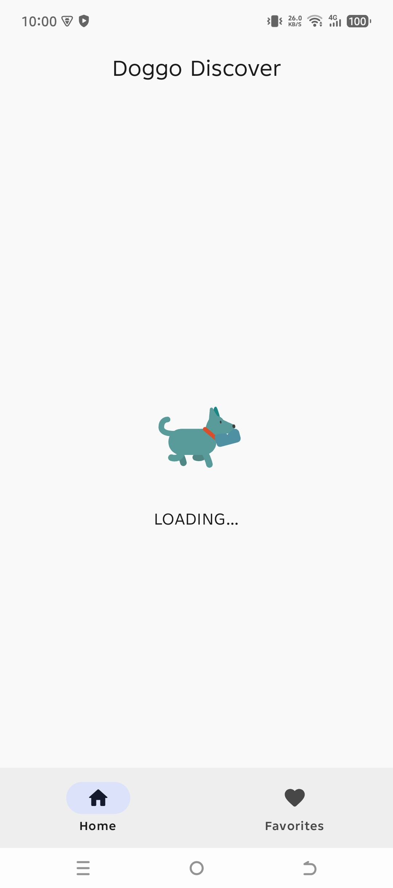
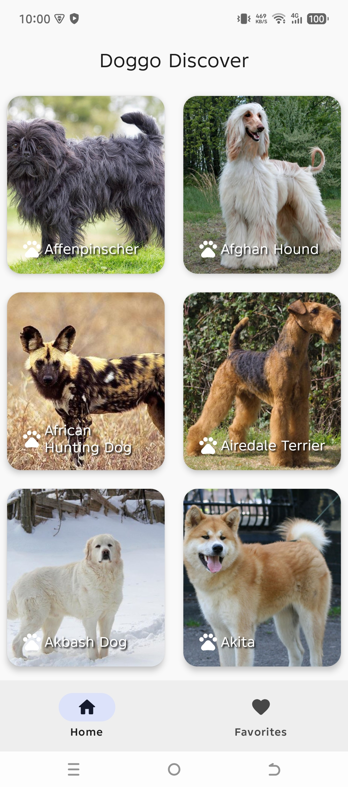
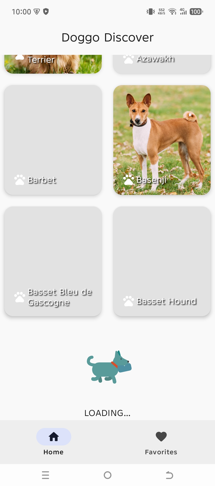
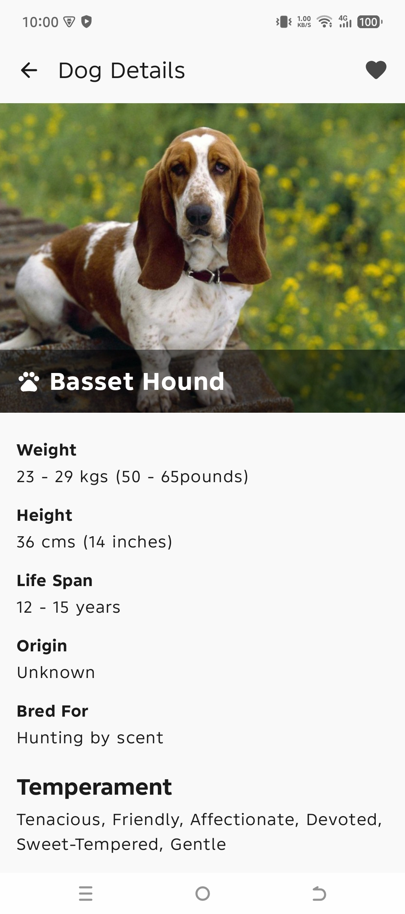
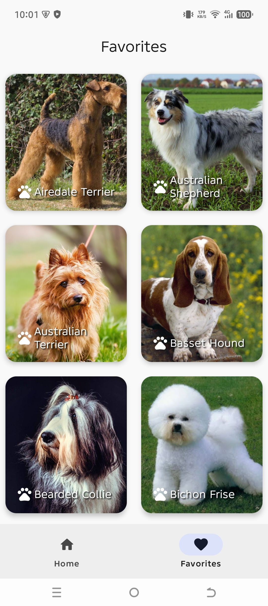
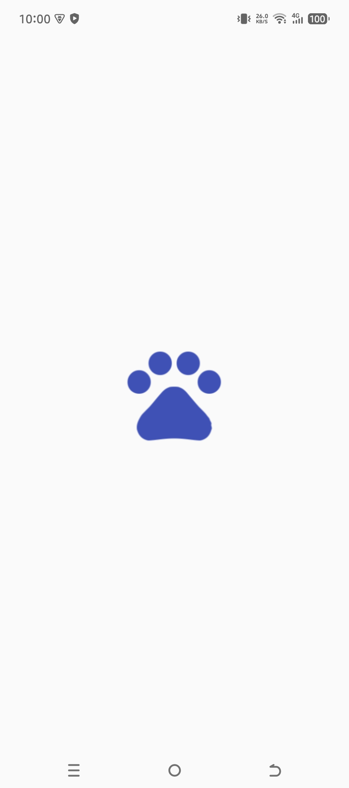
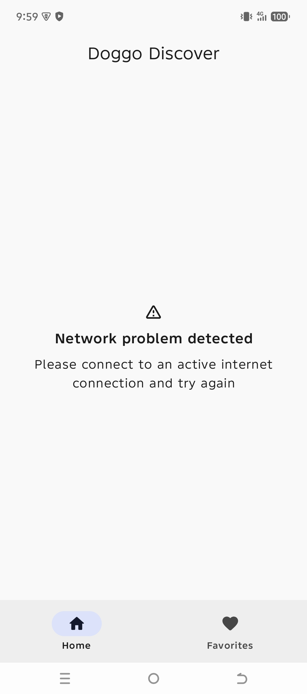
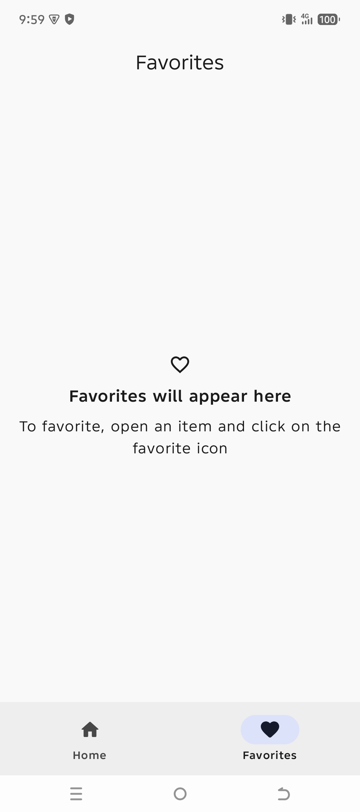

# DoggoDiscover
An Android dog application implemented using the MVVM Clean Architecture pattern, Retrofit, Koin, Coil, Kotlin Flows, ViewModel, Coroutines, Room, Jetpack Compose, Kotlin DSL and some other libraries from the [Android Jetpack](https://developer.android.com/jetpack) . Doggo Discover fetches data from the [Dog API](https://developers.thecatapi.com/) to provide dog information.

## Downloadable apk:
Download apk [here](https://drive.google.com/file/d/1IIE44LzNzhMVVbAVhTTG1YXYYCeaYcTM/view?usp=drive_link) 

## Architecture
The architecture of this application relies and complies with the following points below:
* Pattern [Model-View-ViewModel](https://medium.com/@ami0275/mvvm-clean-architecture-pattern-in-android-with-use-cases-eff7edc2ef76)(MVVM) with Clean Architecture which facilitates separation of different layers of the application.
* [Android architecture components](https://developer.android.com/topic/libraries/architecture/) which help to keep the application robust, testable, and maintainable.

<p align="center"><a></a></p>

## Technologies used:
* [Jetpack Compose](https://developer.android.com/jetpack/compose) - A modern toolkit for building native Android UI in a declarative way.
* [Gradle Kotlin DSL](https://docs.gradle.org/current/userguide/kotlin_dsl.html) - An alternative syntax for writing Gradle build scripts using Kotlin.
* [Version Catalogs](https://developer.android.com/build/migrate-to-catalogs) - A scalable way of maintaining dependencies and plugins in a multi-module project.
* [Retrofit](https://square.github.io/retrofit/) a REST Client for Android which makes it relatively easy to retrieve and upload JSON (or other structured data) via a REST based webservice.
* [okhttp3](https://square.github.io/okhttp/) - Square’s meticulous HTTP client for the JVM, Android, and GraalVM.
* [Koin](https://insert-koin.io/docs/quickstart/android/) for dependency injection.
* [Coil](https://coil-kt.github.io/coil/compose/) - A fast, lightweight, easy to use and modern image loading library.
* [ViewModel](https://developer.android.com/topic/libraries/architecture/viewmodel) to store and manage UI-related data in a lifecycle conscious way.
* [StateFlow](https://developer.android.com/kotlin/flow/stateflow-and-sharedflow#:~:text=StateFlow%20is%20a%20state%2Dholder,property%20of%20the%20MutableStateFlow%20class) to enable flows to emit updated state and emit values to multiple consumers optimally.
* [Kotlin Flow](https://kotlinlang.org/docs/reference/coroutines/flow.html) to emit a stream of data with multiple values sequentially.
* [Timber](https://github.com/JakeWharton/timber) - a logger with a small, extensible API which provides utility on top of Android's normal Log class.
* [Material Design](https://material.io/develop/android/docs/getting-started/) an adaptable system of guidelines, components, and tools that support the best practices of user interface design.
* [Coroutines](https://kotlinlang.org/docs/reference/coroutines-overview.html) used to manage the local storage i.e. `writing to and reading from the database`. Coroutines help in managing background threads and reduces the need for callbacks.
* [Room](https://developer.android.com/topic/libraries/architecture/room) persistence library which provides an abstraction layer over SQLite to allow for more robust database access while harnessing the full power of SQLite.
* [Android KTX](https://developer.android.com/kotlin/ktx) which helps to write more concise, idiomatic Kotlin code.
* [Lottie](https://github.com/airbnb/lottie-android) - A mobile library that parses Adobe After Effects animations exported as json with Bodymovin and renders them natively on mobile.
* [Chucker](https://github.com/ChuckerTeam/chucker) - An HTTP inspector for Android & OkHTTP (like Charles but on device).

## Features
- [X] A composable list of dogs fetched from TheDogAPI.
- [X] A details screen showing more information about a selected dog.
- [X] A way to toggle favorites (⭐) for each dog.
- [X] Separation into layers (Data, Domain, Presentation) with clear responsibilities.
- [X] ViewModels to manage UI state.
- [X] Fetch data using Retrofit with Kotlin Coroutines (no blocking calls).
- [X] Store favorites locally using Room.
- [X] Koin for dependency injection
- [X] Coil for image loading
- [X] Lottie for loading animations
- [X] Pagination for the dog list
- [X] Navigation between screens using Jetpack compose navigation with smooth transition animations
- [X] Some unit tests for Composables, ViewModels, Use Cases, and Repository layers.
- [X] Error handling using CoroutineExceptionHandler and Throwable extensions to handle network failures


## Installation
Doggo Discover requires a minimum API level of 24. Clone the repository. You will need an API key i.e. `DOG_API_KEY` from [Dog API](https://developers.thecatapi.com/) to request data. If you don’t already have an account, you will need to create one in order to request an API Key.

In your project's root directory, inside the `local.properties` file (create one if unavailable) include the following lines:

````properties
DOG_API_KEY="YOUR_API_KEY"
DOG_API_BASE_URL="https://api.thedogapi.com/v1/"
DOG_IMAGE_URL="https://cdn2.thedogapi.com/images/"

````

## Screenshots
  
  
  

## Credits

* [Icon Kitchen](https://icon.kitchen/) was used to generate the launcher icon.

## LICENSE
```
MIT License

Copyright (c) 2025 Tom Munyiri

Permission is hereby granted, free of charge, to any person obtaining a copy
of this software and associated documentation files (the "Software"), to deal
in the Software without restriction, including without limitation the rights
to use, copy, modify, merge, publish, distribute, sublicense, and/or sell
copies of the Software, and to permit persons to whom the Software is
furnished to do so, subject to the following conditions:

The above copyright notice and this permission notice shall be included in all
copies or substantial portions of the Software.

THE SOFTWARE IS PROVIDED "AS IS", WITHOUT WARRANTY OF ANY KIND, EXPRESS OR
IMPLIED, INCLUDING BUT NOT LIMITED TO THE WARRANTIES OF MERCHANTABILITY,
FITNESS FOR A PARTICULAR PURPOSE AND NONINFRINGEMENT. IN NO EVENT SHALL THE
AUTHORS OR COPYRIGHT HOLDERS BE LIABLE FOR ANY CLAIM, DAMAGES OR OTHER
LIABILITY, WHETHER IN AN ACTION OF CONTRACT, TORT OR OTHERWISE, ARISING FROM,
OUT OF OR IN CONNECTION WITH THE SOFTWARE OR THE USE OR OTHER DEALINGS IN THE
SOFTWARE.
```


